# cc-project  vue 版本

angular版本请到 https://github.com/myopenresources/cc-project 这里看

详细文档 请到 [cc-project详细文档（正常编写）](https://www.toutiao.com/c/user/token/MS4wLjABAAAAnEldphQhg0oBXhLDdmI5RkzefU_ikt6GDtUizQ9CCTs/)

## 介绍
cc-project-vue 是一个前后端分离的项目，前端使用的是vue3.0，后端使用srping boot，cc-app-backed为后端部分，cc-front为前端部分。

##  VUE 版本部分界面展示
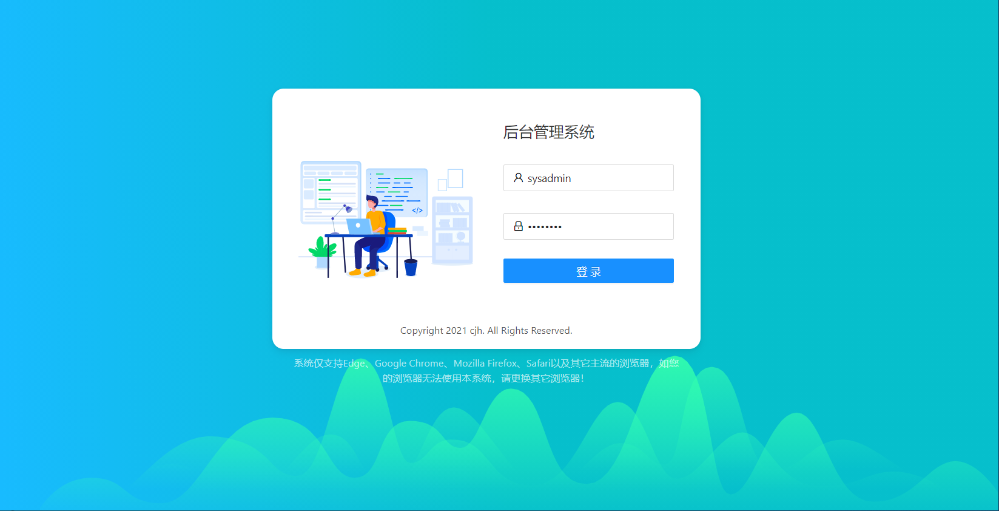  
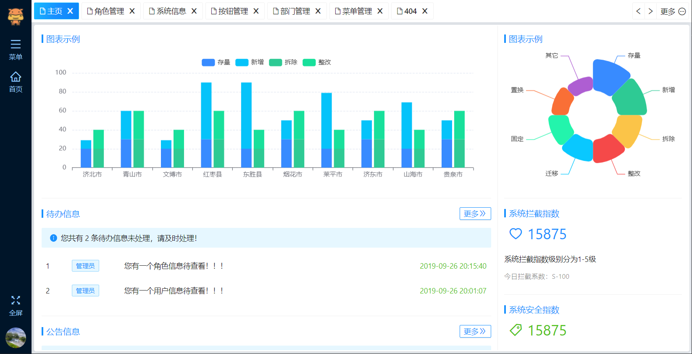  
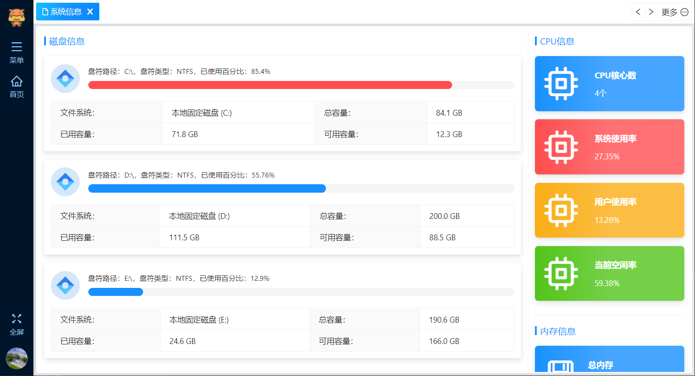  
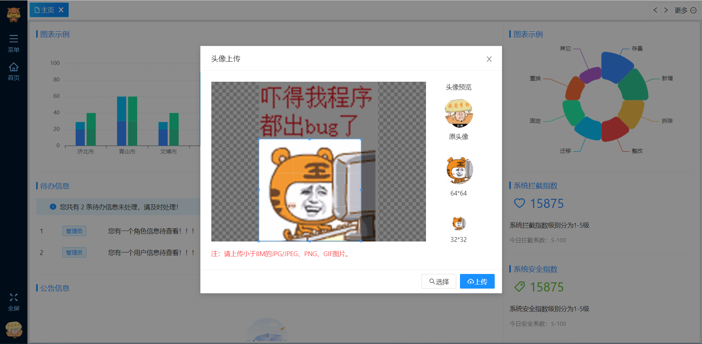  
  
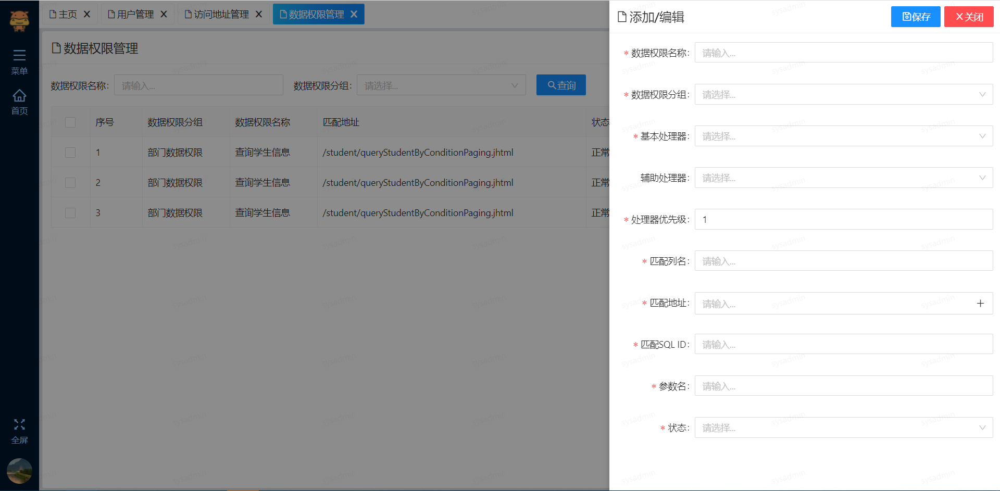  
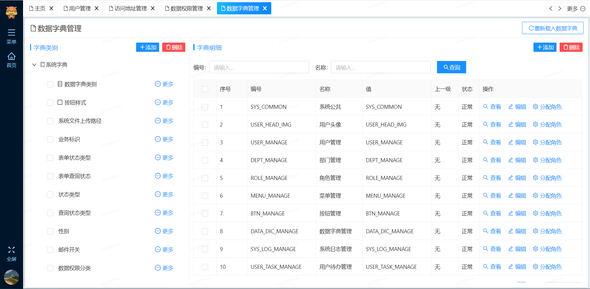  
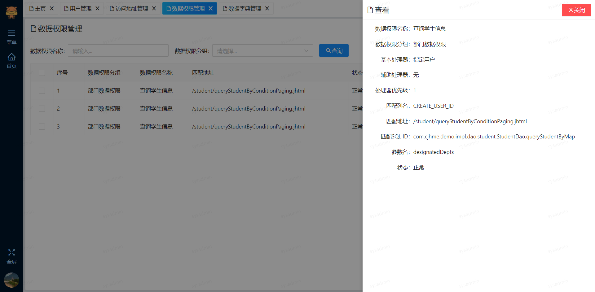  
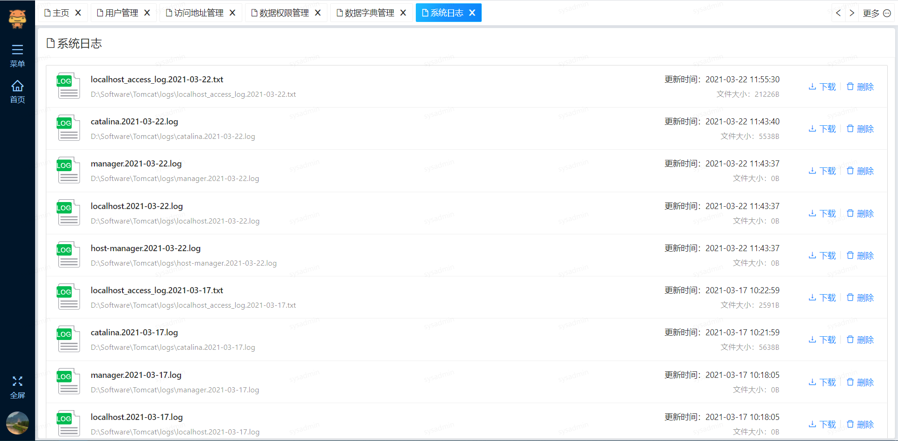  
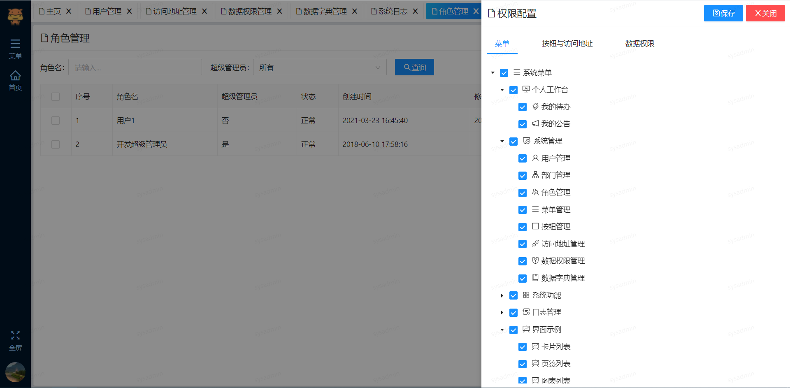  
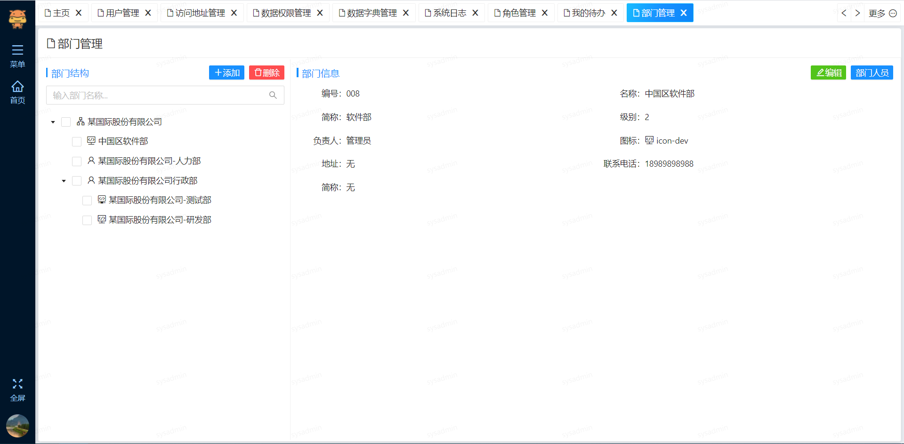  
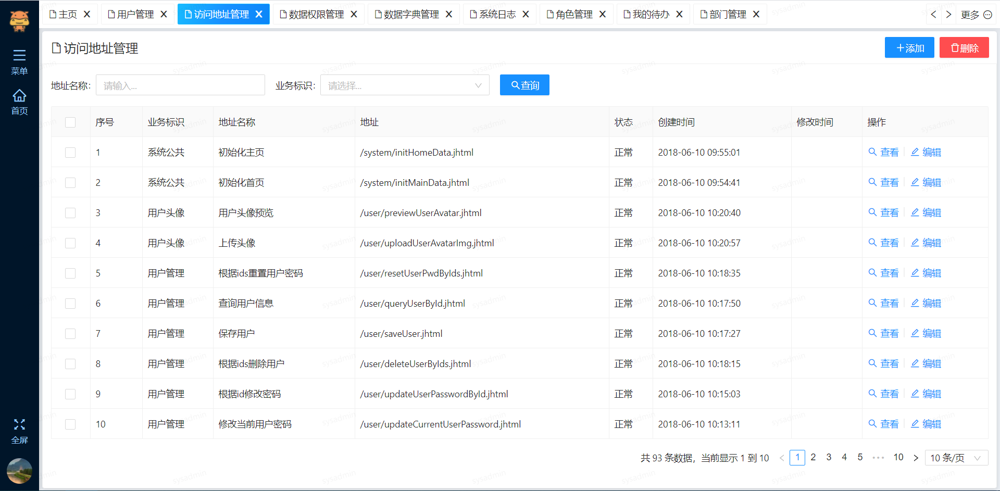  
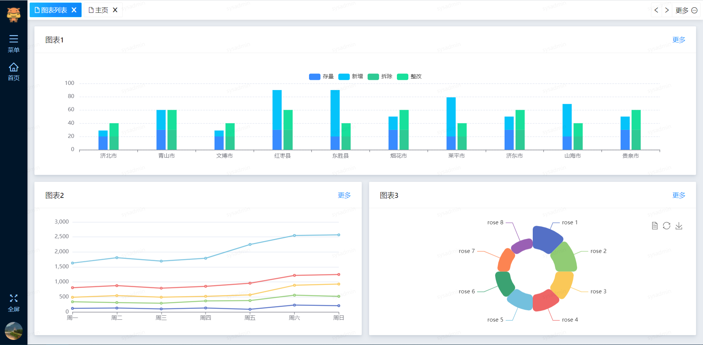  
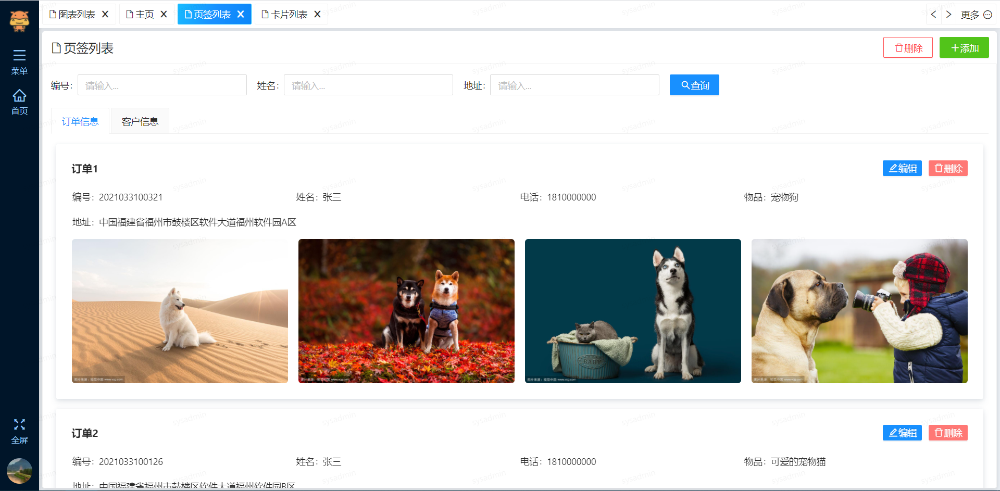  
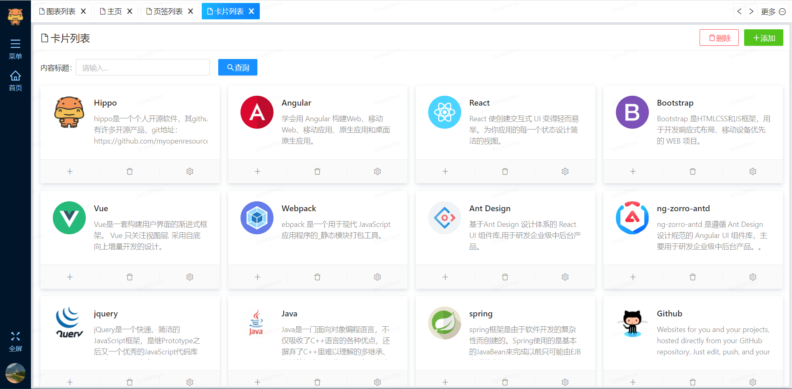  

